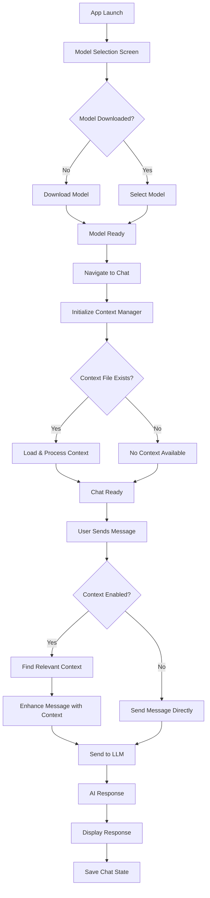

# ReactNativeLLM

A React Native application that enables on-device Large Language Model (LLM) chat functionality with intelligent context management. Built with TypeScript and modern React Native practices.

## 🎥 Demo

https://github.com/Arunkumarvallal/ReactNativeLLM/blob/main/demo.MP4

*Watch the demo video to see ReactNativeLLM in action - model selection, chat interface, and context management features.*

## 🚀 Features

### Core Functionality
- **On-Device LLM Execution**: Run AI models locally without internet dependency
- **Model Management**: Download, select, and manage multiple AI models
- **Interactive Chat Interface**: Seamless messaging experience with Gifted Chat
- **Context-Aware Conversations**: Intelligent context injection from markdown files
- **Theme Support**: Dynamic light/dark theme with system preference detection
- **Network Status**: Real-time network connectivity monitoring

### Context Management System (MCP)
- **Smart Context Processing**: Automatically processes context.md files into searchable chunks
- **Relevance Scoring**: Intelligent keyword matching for context retrieval
- **Manual Context Control**: Toggle context on/off per conversation
- **Context File Management**: Create, refresh, and manage context files
- **Memory Persistence**: Chat history and context state persistence across sessions

## 🏗️ Architecture

### Key Components
- **Model Selection Screen**: Download and select AI models
- **Chat Screen**: Conversation interface with context controls
- **Context Manager**: Processes and manages context from markdown files
- **Theme System**: Centralized theme management with override capabilities
- **Chat State Management**: Persistent chat history per model

### Data Flow



## 📱 Installation & Setup

### Prerequisites
- Node.js (v16 or higher)
- React Native development environment
- iOS Simulator (for iOS development)
- Android Studio & emulator (for Android development)

### Installation
1. **Clone the repository**
   ```bash
   git clone <repository-url>
   cd ReactNativeLLM
   ```

2. **Install dependencies**
   ```bash
   npm install
   # or
   yarn install
   ```

3. **iOS Setup** (macOS only)
   ```bash
   cd ios && pod install && cd ..
   ```

## 🏃‍♂️ Running the Application

### Start Metro Bundler
```bash
npm start
# or
yarn start
```

### Run on iOS
```bash
npm run ios
# or
yarn ios

# For specific simulator
npx react-native run-ios --simulator="iPhone 15 Pro"
```

### Run on Android
```bash
npm run android
# or
yarn android

# For specific device
npx react-native run-android --deviceId=<device-id>
```

### Additional Commands
```bash
# Clean build (if experiencing issues)
npm run clean
# or
yarn clean

# Run tests
npm test
# or
yarn test

# TypeScript type checking
npx tsc --noEmit

# Lint code
npx eslint . --ext .js,.jsx,.ts,.tsx
```

## 📋 Usage Guide

### 1. Model Management
- Launch the app to see the Model Selection screen
- Download required AI models using the download button
- Select a downloaded model to proceed to chat
- Network connectivity required for initial model download

### 2. Chat Interface
- **Context Toggle**: Enable/disable context injection for conversations
- **Theme Toggle**: Switch between light and dark modes
- **Context Refresh**: Manually refresh context from file system
- **Back Navigation**: Return to model selection

### 3. Context System
- Create a `context.md` file in the app's document directory
- Use the context toggle button (long press) to create a test context file
- Context is automatically processed into searchable chunks
- Relevant context is injected into conversations when enabled

### 4. Context File Format
Create a `context.md` file with the sections.

## 📁 Project Structure

```
src/
├── components/           # Reusable UI components
│   ├── ChatHeader.tsx           # Chat screen header with controls
│   ├── ContextToggleButton.tsx  # Context enable/disable button
│   ├── CustomGiftedChat.tsx     # Customized chat interface
│   ├── ModelSelection.tsx       # Model list and download UI
│   └── ThemeToggleButton.tsx    # Theme switching component
├── hooks/               # Custom React hooks
│   ├── useChatMessages.ts       # Chat message management
│   ├── useContextManager.ts     # Context system integration
│   ├── useModelDownload.ts      # Model download management
│   └── useModelPreparation.ts   # Model loading and preparation
├── screens/             # Main application screens
│   ├── ChatScreen.tsx           # Chat interface screen
│   └── ModelSelectionScreen.tsx # Model management screen
├── services/            # Business logic and external services
│   ├── ContextFileManager.ts    # File system operations
│   ├── ContextProcessor.ts      # Context processing logic
│   ├── MCPContextManager.ts     # Main context orchestration
│   └── TestContextHelper.ts     # Development utilities
├── theme/               # Theme management
│   ├── ThemeContext.tsx         # Theme context provider
│   └── theme.ts                 # Theme definitions
├── types/               # TypeScript type definitions
└── utils/               # Utility functions and constants
```

## 🔧 Key Technologies

- **React Native**: Cross-platform mobile development
- **TypeScript**: Type-safe development
- **react-native-ai**: Local LLM execution
- **React Navigation**: Navigation management
- **Gifted Chat**: Chat UI components
- **Phosphor React Native**: Icon library
- **React Native FS**: File system operations

## 🐛 Troubleshooting

### Common Issues

1. **Metro bundler issues**
   ```bash
   npx react-native start --reset-cache
   ```

2. **iOS build issues**
   ```bash
   cd ios && pod install && cd ..
   npx react-native run-ios --clean
   ```

3. **Android build issues**
   ```bash
   cd android && ./gradlew clean && cd ..
   npx react-native run-android
   ```

4. **Context not loading**
   - Check if context.md exists in document directory
   - Use the refresh button to manually reload context
   - Verify file permissions and content format

## 📝 Development Notes

- Models are stored locally using react-native-ai package
- Chat state is persisted in memory per model session
- Context files are monitored for changes (manual refresh required)
- Theme preference follows system settings by default
- Network status affects model download capability

## 🚧 Future Enhancements

- [ ] Model deletion functionality
- [ ] Context file editing within app
- [ ] Conversation export/import
- [ ] Advanced context search and filtering
- [ ] Multi-language support
- [ ] Voice input/output integration

## 📄 License

This project is licensed under the MIT License - see the LICENSE file for details.
