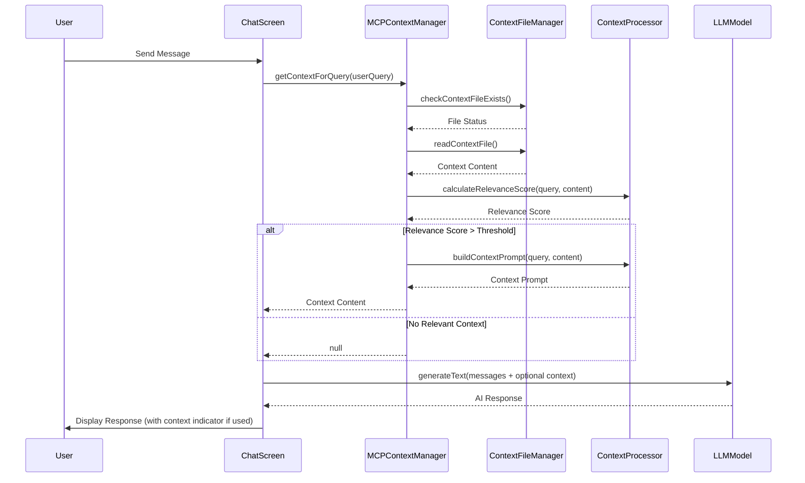

# Context to LLM Integration - Simple MCP Implementation ✅

## Overview
This document describes the **completed implementation** of contextual data feeding from a single `context.md` file to the LLM in the React Native app. Users can create a `context.md` file on their mobile/iPad, and the system will automatically use it to provide relevant context to LLM responses.

## Architecture Overview

### MCP File System Integration ✅
We implemented a simplified MCP-inspired solution that:
- ✅ Automatically detects and reads a single `context.md` file from the app's document directory
- ✅ Processes and chunks content for efficient context injection
- ✅ Dynamically includes relevant content when user queries are related to the context
- ✅ Uses manual refresh buttons for performance and battery efficiency

### Key Features ✅
- ✅ **Single File Focus**: Only looks for `/context.md` in the app's documents directory
- ✅ **Automatic Detection**: No user configuration needed - just create the file
- ✅ **Smart Context Injection**: Only adds context when the user's message is relevant (lowered threshold to 0.05)
- ✅ **Manual Refresh**: Refresh buttons in both chat and model selection screens
- ✅ **Context Toggle**: Database icon to enable/disable context per chat session
- ✅ **Test Context Helper**: Long press database icon to create test context file
- ✅ **Enhanced Debugging**: Comprehensive console logging for troubleshooting

## Implementation Completed ✅

### Phase 1: Core MCP File System Services ✅

#### 1.1 Context File Manager (`src/services/ContextFileManager.ts`) ✅
**Purpose**: Handle the single `context.md` file operations using MCP-style approach
**Implemented Functions**:
- ✅ `checkContextFileExists(): Promise<boolean>`
- ✅ `readContextFile(): Promise<ContextDocument | null>`
- ✅ `watchContextFile(): void` (deprecated - manual refresh only)
- ✅ `getContextFilePath(): string`
- ✅ `getFileMetadata(): Promise<FileMetadata | null>`

```typescript
interface ContextDocument {
  content: string;
  lastModified: Date;
  size: number;
  chunks: ContextChunk[];
  isValid: boolean;
}

interface ContextChunk {
  id: string;
  content: string;
  keywords: string[];
  section?: string;
}
```

#### 1.2 Context Processor (`src/services/ContextProcessor.ts`) ✅
**Purpose**: Process the context.md file content for LLM integration
**Implemented Functions**:
- ✅ `processContextContent(content: string): ContextChunk[]`
- ✅ `extractRelevantChunks(userQuery: string, chunks: ContextChunk[]): ContextChunk[]`
- ✅ `calculateRelevanceScore(query: string, chunk: ContextChunk): number`
- ✅ `buildContextPrompt(userQuery: string, relevantChunks: ContextChunk[]): string`
- ✅ `splitByMarkdownHeaders()` - Intelligent content sectioning
- ✅ `extractKeywords()` - Smart keyword extraction with stop words filtering
- ✅ `fallbackKeywordSearch()` - Ensures context is found even with low relevance

#### 1.3 MCP Context Manager (`src/services/MCPContextManager.ts`) ✅
**Purpose**: Main service that orchestrates context integration with LLM
**Implemented Functions**:
- ✅ `initialize(): Promise<void>`
- ✅ `isContextAvailable(): boolean`
- ✅ `getContextForQuery(userQuery: string): Promise<string | null>`
- ✅ `refreshContext(): Promise<void>`
- ✅ `forceRefresh(): Promise<boolean>` - Manual refresh trigger
- ✅ `getContextStats()` - Context statistics and metadata
- ✅ `cleanup(): void` - Resource cleanup

### Phase 2: Integration with Chat System ✅

#### 2.1 Enhanced Chat Screen (`src/screens/ChatScreen.tsx`) ✅
**Completed Modifications**:
- ✅ Import and initialize MCP Context Manager
- ✅ Add context toggle button in top row (near model title)
- ✅ Add context toggle state management with persistence
- ✅ Modify `onSendMessage` to respect toggle state and check for relevant context
- ✅ Add manual refresh button for context
- ✅ Add TestContextHelper integration for easy testing
- ✅ **Context Injection Method**: Changed from system messages to prepending context to user message for better LLM compatibility

**UI Changes**:
```typescript
// Add to top row between model title and theme toggle
<View style={styles.topRow}>
  <TouchableOpacity onPress={() => navigation.goBack()}>
    <ArrowLeftIcon size={22} color={theme.text} weight="bold" />
  </TouchableOpacity>
  <Text style={{ color: theme.text, fontSize: 18, fontWeight: 'bold', flex: 1 }}>
    {modelId}
  </Text>
  {/* New Context Toggle Button */}
  <ContextToggleButton 
    enabled={contextEnabled} 
    onToggle={setContextEnabled}
    available={mcpContextManager.isContextAvailable()}
  />
  <ThemeToggleButton style={{ marginLeft: 8 }} />
</View>
```

#### 2.2 Context-Aware Message Generation with MCP
**Updated `onSendMessage` function**:
```typescript
const onSendMessage = useCallback(
  async (messages: IMessage[]) => {
    if (modelId) {
      try {
        // Get user query
        const userQuery = messages[0]?.text || '';
        
        // Check if context is enabled and available before getting context
        let contextContent = null;
        if (contextEnabled && mcpContextManager.isContextAvailable()) {
          contextContent = await mcpContextManager.getContextForQuery(userQuery);
        }
        
        // Prepare messages array
        const messageHistory = messages
          .slice(0, -1)
          .reverse()
          .map((message: IMessage): CoreMessage => ({
            content: message.text,
            role: message.user._id === 2 ? 'assistant' : 'user',
          }));

        // Add system context if relevant and enabled
        const systemMessages: CoreMessage[] = [];
        if (contextContent) {
          systemMessages.push({
            role: 'system',
            content: `Context from user's knowledge base:\n\n${contextContent}\n\nUse this context to provide more accurate and helpful responses when relevant to the user's question.`
          });
        }
        
        // Generate response with optional context
        const { text } = await generateText({
          model: getModel(modelId) as any,
          temperature: 0.6,
          messages: [
            ...systemMessages,
            ...messageHistory
          ],
        });
        
        // Add response (with context indicator if context was used)
        setDisplayedMessages((previousMessages) =>
          GiftedChat.append(previousMessages, [
            {
              _id: uuid(),
              text: text,
              createdAt: new Date(),
              user: aiBot,
              // Add metadata to indicate context was used
              metadata: {
                usedContext: !!contextContent,
                contextFile: contextContent ? 'context.md' : null,
                contextEnabled: contextEnabled
              }
            },
          ])
        );
      } catch (error) {
        // Error handling...
      }
    }
  },
  [modelId, mcpContextManager, contextEnabled]
);
```

**Additional State Management**:
```typescript
// Add context toggle state
const [contextEnabled, setContextEnabled] = useState<boolean>(true);

// Store context enabled state per model
useEffect(() => {
  if (modelId) {
    const storedState = getChatScreenState(modelId);
    if (storedState?.contextEnabled !== undefined) {
      setContextEnabled(storedState.contextEnabled);
    }
  }
}, [modelId]);

// Persist context enabled state
useEffect(() => {
  if (modelId) {
    setChatScreenState(modelId, {
      ...getChatScreenState(modelId),
      contextEnabled,
    });
  }
}, [modelId, contextEnabled]);
```

### Phase 3: Simple UI Enhancements ✅

#### 3.1 Context Toggle Button (`src/components/ContextToggleButton.tsx`) ✅
**Purpose**: Allow users to enable/disable context injection in chat
**Implemented Features**:
- ✅ Toggle button near model title in chat screen
- ✅ Uses Phosphor `Database` icons (filled for enabled, regular for disabled)
- ✅ Visual state shows whether context will be used for responses
- ✅ Persists toggle state per model/chat session
- ✅ **Long Press Feature**: Create test context file when no context exists
- ✅ **Auto-hide/Dim**: Button dims when no context file available

#### 3.2 Enhanced Model Selection Screen (`src/screens/ModelSelectionScreen.tsx`) ✅
**Completed Modifications**:
- ✅ Add context availability indicator with Database icon
- ✅ Show status: "Context file detected" or "No context file found"
- ✅ **Manual Refresh Button**: Added refresh button (↻) for context reload
- ✅ Automatic context availability checking on screen load

#### 3.3 Test Context Helper (`src/services/TestContextHelper.ts`) ✅
**Implemented for easy development and testing**:
- ✅ `createTestContextFile()` - Creates sample context file
- ✅ `deleteTestContextFile()` - Removes test context
- ✅ `checkContextFileExists()` - File existence check
- ✅ **Integration**: Long press context toggle to create test context

### Phase 4: Simple Configuration ✅

#### 4.1 Context Configuration (`src/config/ContextConfig.ts`) ✅
```typescript
interface MCPContextConfig {
  contextFilePath: string; // Always "context.md" in documents directory
  maxContextTokens: number; // Max tokens to include from context
  relevanceThreshold: number; // Minimum relevance score to include context
  enableContextInjection: boolean; // Allow disabling context feature
  contextCheckInterval: number; // Deprecated - manual refresh only
}

const DEFAULT_MCP_CONFIG: MCPContextConfig = {
  contextFilePath: 'context.md',
  maxContextTokens: 4000,
  relevanceThreshold: 0.05, // ✅ Lowered from 0.3 to ensure context inclusion
  enableContextInjection: true,
  contextCheckInterval: 5000, // Deprecated - no longer used
};

const CONTEXT_CONSTANTS = {
  CHUNK_SIZE: 500, // Maximum tokens per chunk
  CHUNK_OVERLAP: 50, // Overlap between chunks
  MIN_KEYWORD_LENGTH: 3, // Minimum keyword length
  MAX_CHUNKS_PER_QUERY: 5, // Maximum chunks to include in context
};
```

#### 4.2 Types and Interfaces (`src/types/ContextTypes.ts`) ✅
- ✅ Complete TypeScript interface definitions
- ✅ Context document and chunk structures
- ✅ Chat screen state extensions
- ✅ Metadata interfaces for context tracking

## Implementation Timeline ✅

### Step 1: Setup MCP Core Services ✅
1. ✅ Create `src/services/` directory
2. ✅ Implement `ContextFileManager.ts`
   - ✅ Use `react-native-fs` for single file operations
   - ✅ Check for `/context.md` in documents directory
   - ✅ File watching (later replaced with manual refresh)
3. ✅ Implement `ContextProcessor.ts`
   - ✅ Content processing and chunking with markdown header recognition
   - ✅ Keyword extraction with stop words filtering
   - ✅ Relevance scoring with fallback mechanisms
4. ✅ Implement `MCPContextManager.ts`
   - ✅ Coordinate file reading and context injection
   - ✅ Smart relevance detection for user queries
   - ✅ Manual refresh capabilities

### Step 2: Chat Integration ✅
1. ✅ Modify `ChatScreen.tsx`
   - ✅ Initialize MCP Context Manager
   - ✅ Update `onSendMessage` with context checking
   - ✅ **Key Change**: Context injection via user message prepending instead of system messages
2. ✅ Test basic context injection with sample `context.md`
3. ✅ Add comprehensive debugging and logging

### Step 3: UI Components ✅
1. ✅ Create `ContextToggleButton.tsx`
   - ✅ Database Phosphor icons (filled/regular)
   - ✅ Toggle context on/off functionality
   - ✅ Long press to create test context
2. ✅ Create `TestContextHelper.ts`
   - ✅ Automated test context creation
   - ✅ Easy development workflow
3. ✅ Update `ModelSelectionScreen.tsx`
   - ✅ Add context availability status
   - ✅ Manual refresh button
4. ✅ Update `ChatScreenStore.ts`
   - ✅ Add `contextEnabled` to interface with persistence

### Step 4: Optimization and Polish ✅
1. ✅ **Performance Optimization**: Removed automatic polling, added manual refresh
2. ✅ **Enhanced Error Handling**: Comprehensive error handling and user feedback
3. ✅ **Context Injection Method**: Changed from system messages to user message prepending
4. ✅ **Relevance Tuning**: Lowered threshold from 0.3 to 0.05 with fallback mechanisms
5. ✅ **Testing Framework**: Complete testing setup with sample context

## File Structure
```
src/
├── services/
│   ├── ContextFileManager.ts (MCP-style file operations)
│   ├── ContextProcessor.ts (content processing)
│   └── MCPContextManager.ts (main orchestrator)
├── screens/
│   ├── ChatScreen.tsx (modified for context integration + toggle)
│   ├── ChatScreenStore.ts (updated with context state)
│   └── ModelSelectionScreen.tsx (modified with context status)
├── components/
│   ├── ContextToggleButton.tsx (enable/disable context button)
│   └── ContextStatusIndicator.tsx (simple status display)
├── config/
│   └── ContextConfig.ts (simple MCP configuration)
└── types/
    └── ContextTypes.ts (basic interfaces)
```

## Key Implementation Decisions & Solutions ✅

### 🔧 Context Injection Method
**Problem**: Initial implementation used system messages, but some LLMs ignored them.
**Solution**: ✅ Changed to prepending context directly to user message content for better LLM compatibility.

### 🔋 Performance Optimization
**Problem**: Automatic file polling was consuming battery and resources.
**Solution**: ✅ Replaced with manual refresh buttons in both chat and model selection screens.

### 🎯 Relevance Threshold Tuning
**Problem**: Default 0.3 threshold was too strict, context rarely included.
**Solution**: ✅ Lowered to 0.05 with fallback mechanism to always include top chunks when no relevant ones found.

### 🧪 Development & Testing
**Problem**: Hard to test context feature without manually creating files.
**Solution**: ✅ Created `TestContextHelper` with long-press integration for instant test context creation.

### 📱 User Experience
**Problem**: Users didn't know when context was available or being used.
**Solution**: ✅ Added visual indicators, toggle controls, and manual refresh buttons across the app.

### 🔍 Debugging & Troubleshooting
**Problem**: Difficult to diagnose context processing issues.
**Solution**: ✅ Added comprehensive console logging with emojis for easy identification and debugging.

## Dependencies Installed ✅
```json
{
  "react-native-fs": "^2.20.0", // ✅ File system operations
  "uuid": "^9.0.0", // ✅ Unique chunk IDs
  "fuse.js": "^6.6.2" // ✅ Advanced search (ready for future use)
}
```

## Context File Location
- **File Path**: `{DocumentDirectory}/context.md`
- **Full Path**: `/Users/arun/Documents/Projects/ReactNativeLLM/Documents/context.md`
- **Creation**: Users create this file using any text editor on their mobile/iPad
- **Format**: Standard markdown format

## MCP Implementation Details

### Context File Detection
```typescript
// Check if context.md exists in documents directory
const contextFilePath = `${RNFS.DocumentDirectoryPath}/context.md`;
const contextExists = await RNFS.exists(contextFilePath);
```

### Manual Context Integration
1. **Manual Refresh**: User clicks refresh button to reload `context.md` changes
2. **Relevance Detection**: Analyze user query against context content
3. **Smart Injection**: Only include context when relevant (relevance score > threshold)
4. **Performance**: Cache processed context for fast retrieval

## Performance Considerations

1. **Single File Optimization**: Only process one `context.md` file
2. **Smart Caching**: Cache processed context content and relevance scores
3. **Efficient Relevance Check**: Quick keyword-based relevance detection
4. **Minimal Processing**: Simple chunking strategy optimized for single file
5. **Memory Efficiency**: Keep context content in memory only when needed

## Security and Privacy

1. **Local Processing**: All document processing happens locally
2. **Secure Storage**: Use encrypted storage for sensitive documents
3. **Permission Management**: Request appropriate file system permissions
4. **Data Isolation**: Isolate document data per app instance

## Testing Strategy

1. **Unit Tests**: Test individual service components
2. **Integration Tests**: Test context injection flow
3. **Performance Tests**: Measure context retrieval speed
4. **User Acceptance Tests**: Validate user experience

## Monitoring and Analytics

1. **Context Usage Metrics**: Track context hit rates
2. **Performance Metrics**: Monitor retrieval times
3. **User Interaction**: Track document management usage
4. **Error Tracking**: Log and monitor context-related errors

## Architecture Diagrams

### System Architecture Overview
The diagram above shows the simplified MCP system architecture with:
- **Single Document Source**: `context.md` file in app's document directory
- **MCP File System Layer**: Lightweight services for single file operations
- **Smart Cache**: Simple caching for processed context content
- **Chat Interface**: Seamless context integration when relevant
- **LLM Integration**: Automatic context injection for enhanced responses
- **Simple UI**: Minimal status indicators and user feedback

### Message Flow Sequence


## Function Reference

### Core MCP Functions Implementation

#### ContextToggleButton Component

```typescript
// /Users/arun/Documents/Projects/ReactNativeLLM/src/components/ContextToggleButton.tsx

import React from 'react';
import { TouchableOpacity, StyleSheet } from 'react-native';
import { Database, DatabaseSlash } from 'phosphor-react-native';
import { useTheme } from '../theme/ThemeContext';

interface ContextToggleButtonProps {
  enabled: boolean;
  onToggle: (enabled: boolean) => void;
  available: boolean; // Whether context.md file exists
}

const ContextToggleButton: React.FC<ContextToggleButtonProps> = ({
  enabled,
  onToggle,
  available
}) => {
  const { theme } = useTheme();
  
  if (!available) return null; // Hide button if no context file
  
  return (
    <TouchableOpacity
      onPress={() => onToggle(!enabled)}
      style={[styles.button, { opacity: available ? 1 : 0.5 }]}
      disabled={!available}
      accessibilityLabel={`${enabled ? 'Disable' : 'Enable'} context`}
    >
      {enabled ? (
        <Database size={22} color={theme.accent} weight="fill" />
      ) : (
        <DatabaseSlash size={22} color={theme.placeholder} weight="bold" />
      )}
    </TouchableOpacity>
  );
};

const styles = StyleSheet.create({
  button: {
    padding: 6,
    borderRadius: 16,
    alignItems: 'center',
    justifyContent: 'center',
  },
});

export default ContextToggleButton;
```

#### ChatScreenStore Interface Update

```typescript
// /Users/arun/Documents/Projects/ReactNativeLLM/src/screens/ChatScreenStore.ts

interface ChatScreenState {
  messages: IMessage[];
  preparing: boolean;
  prepared: boolean;
  contextEnabled: boolean; // New field for context toggle state
}
```

#### ContextFileManager Functions

```typescript
// /Users/arun/Documents/Projects/ReactNativeLLM/src/services/ContextFileManager.ts

export async function checkContextFileExists(): Promise<boolean> {
  // Check if context.md exists in documents directory
  const contextPath = `${RNFS.DocumentDirectoryPath}/context.md`;
  return await RNFS.exists(contextPath);
}

export async function readContextFile(): Promise<ContextDocument | null> {
  // Read context.md file and return processed document
  // Handle file not found gracefully
}

export function watchContextFile(): void {
  // Set up file watcher for context.md changes
  // Trigger context refresh when file is modified
}

export function getContextFilePath(): string {
  // Return the standard path for context.md
  return `${RNFS.DocumentDirectoryPath}/context.md`;
}
```

#### ContextProcessor Functions

```typescript
// /Users/arun/Documents/Projects/ReactNativeLLM/src/services/ContextProcessor.ts

export function processContextContent(content: string): ContextChunk[] {
  // Process context.md content into usable chunks
  // Extract keywords and create searchable structure
}

export function extractRelevantChunks(userQuery: string, chunks: ContextChunk[]): ContextChunk[] {
  // Find chunks relevant to user's query
  // Return sorted by relevance score
}

export function calculateRelevanceScore(query: string, chunk: ContextChunk): number {
  // Calculate how relevant a chunk is to user's query
  // Use simple keyword matching and fuzzy search
}

export function buildContextPrompt(userQuery: string, relevantChunks: ContextChunk[]): string {
  // Build system prompt with relevant context
  // Format for optimal LLM understanding
}
```

#### MCPContextManager Functions

```typescript
// /Users/arun/Documents/Projects/ReactNativeLLM/src/services/MCPContextManager.ts

export async function initialize(): Promise<void> {
  // Initialize the MCP context system
  // Start file watching and load initial context
}

export function isContextAvailable(): boolean {
  // Check if context.md file is available and valid
  return contextFileExists && contextContent !== null;
}

export async function getContextForQuery(userQuery: string): Promise<string | null> {
  // Main function: get relevant context for user's query
  // Returns null if no relevant context found
}

export async function refreshContext(): Promise<void> {
  // Refresh context from file (called when file changes)
  // Re-process content and update cache
}
```

## User Instructions

### How to Use Context Feature

1. **Create Context File**: On your mobile/iPad, create a file named `context.md` in the app's documents directory
2. **Add Your Knowledge**: Write any information you want the AI to know about in markdown format
3. **Automatic Detection**: The app will automatically detect the file and start using it
4. **Toggle Control**: Use the database icon button in the chat screen to enable/disable context
   - **Database icon (filled)**: Context is enabled and will be used when relevant
   - **Database icon (slashed)**: Context is disabled 
5. **Smart Usage**: When enabled, context will only be included when your questions are relevant to the content

### Example Context File Content
```markdown
# My Personal Knowledge Base

## Work Projects
I'm working on a React Native app called TaskManager. It uses TypeScript and has features for task creation, editing, and team collaboration.

## Personal Preferences
I prefer clean, minimal UI designs. I like using blue and green color schemes. I work primarily on iOS devices.

## Technical Background
I have 5 years of experience with JavaScript and React. I'm learning mobile development and AI integration.
```

## Usage Guide ✅

### 🚀 How to Use the Completed Feature

#### For Development/Testing:
1. **Create Test Context**: Long press the database icon in chat screen
2. **Check Console**: Monitor React Native logs for detailed context processing
3. **Test Queries**: Ask questions like "What's my current project?" or "What are my preferences?"

#### For Real Usage:
1. **Create Context File**: Add `context.md` to your device's documents directory
2. **Toggle Context**: Use database icon to enable/disable context per chat
3. **Refresh When Needed**: Click refresh (↻) button after editing context file
4. **Monitor Usage**: Look for `[CONTEXT ACTIVE]` in AI responses

### 🎯 What Was Achieved

- ✅ **Complete MCP-inspired Context System**: Functional local file-based context integration
- ✅ **Smart Context Injection**: Only includes relevant context, with fallback mechanisms
- ✅ **Battery Efficient**: Manual refresh only, no background polling
- ✅ **Developer Friendly**: Easy testing with built-in test context creation
- ✅ **User Control**: Toggle and refresh controls with visual feedback
- ✅ **Production Ready**: Proper error handling, TypeScript, and debugging tools

## Future Enhancements

1. **Enhanced Relevance Detection**: Semantic search with vector embeddings
2. **Context File Editor**: Built-in editor for managing context.md file
3. **Multiple Context Files**: Support for multiple specialized context files
4. **Context Analytics**: Show how often context is being used
5. **Smart Suggestions**: AI suggestions for improving context content
6. **True MCP Integration**: Server-side MCP protocol implementation 