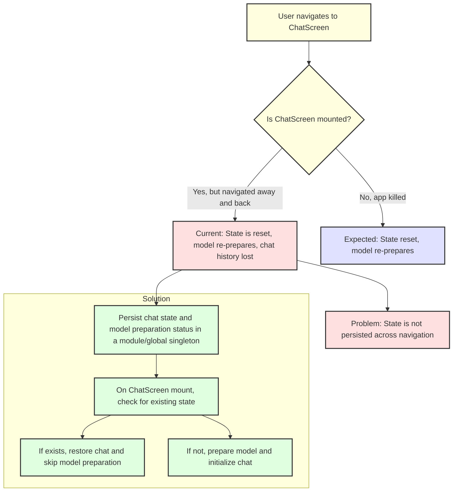

# Plan to Persist Chat State and Model Preparation in ChatScreen

## Problem
- When navigating away from and back to `src/screens/ChatScreen.tsx` (without killing the app), the chat history and model preparation state are lost.
- The model is re-prepared and the chat is reset every time the screen is re-mounted.
- Expected: Only reset when the app is killed, not on navigation.

## Root Cause
- State is stored in React component state (`useState`), which is reset on unmount/remount.
- No persistence of chat messages or model preparation status across navigation.

## Solution Overview
Persist chat state and model preparation status in a module-level singleton or global store (in-memory, not AsyncStorage). Restore this state on ChatScreen mount if available.

---

## Implementation Steps

1. **Create a Singleton Store**
   - Create a new file: `src/screens/ChatScreenStore.ts`
   - Store chat messages and model preparation status keyed by `modelId`.

2. **Update ChatScreen to Use Store**
   - On mount, check the store for existing chat and preparation state for the current `modelId`.
   - If found, restore chat and skip model preparation.
   - If not found, prepare the model and initialize chat as before.
   - On every message send or model preparation, update the store.

3. **Reset Store Only on App Kill**
   - Since the store is in-memory, it will reset only when the app is killed (as expected).

---

## Diagram

---

## File Paths
- Chat screen: `src/screens/ChatScreen.tsx`
- New store: `src/screens/ChatScreenStore.ts`

---

## Optional Future Improvements
- Persist chat state to disk (AsyncStorage) for even more resilience (survives app kill).
- Add a "Clear Chat" button to allow users to manually reset chat.
