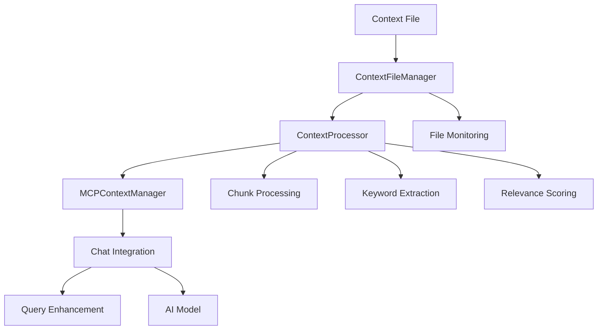

# Advanced Context Integration

Deep dive into the context system architecture, customization options, and advanced integration patterns for ReactNativeLLM.

## 🧠 Context System Architecture

### Overview

The context system in ReactNativeLLM implements a sophisticated pipeline for processing, scoring, and injecting relevant information into AI conversations. Understanding this architecture enables advanced customizations and optimizations.

### Core Components



### Data Flow Pipeline

1. **File Detection**: `ContextFileManager` monitors for `context.md`
2. **Content Processing**: `ContextProcessor` chunks and analyzes content
3. **Query Matching**: Real-time relevance scoring for user queries
4. **Context Injection**: Relevant chunks added to AI prompts
5. **Response Generation**: AI generates context-aware responses

## 🔧 Advanced Configuration

### Custom Context Configuration

```typescript
// Custom context configuration
export const ADVANCED_MCP_CONFIG: MCPContextConfig = {
  contextFilePath: 'context.md',
  maxContextTokens: 6000,           // Increased context window
  relevanceThreshold: 0.03,         // Lower threshold for broader matching
  enableContextInjection: true,
  contextCheckInterval: 3000,       // More frequent checking
  
  // Advanced options
  enableSemanticSearch: true,       // Future: semantic embeddings
  contextPriority: 'relevance',     // 'relevance' | 'recency' | 'mixed'
  enableContextCaching: true,       // Cache processed chunks
  maxChunksPerQuery: 8,            // More chunks for complex queries
  chunkOverlapRatio: 0.1,          // 10% overlap between chunks
};
```

### Advanced Chunk Processing

```typescript
// Custom chunk processing with semantic analysis
class AdvancedContextProcessor extends ContextProcessor {
  
  processContextContent(content: string): ContextChunk[] {
    const sections = this.splitBySemanticBoundaries(content);
    const chunks: ContextChunk[] = [];
    
    sections.forEach(section => {
      const enhancedChunks = this.createSemanticChunks(section);
      chunks.push(...enhancedChunks);
    });
    
    return this.optimizeChunkDistribution(chunks);
  }
  
  private splitBySemanticBoundaries(content: string): Section[] {
    // Advanced section detection using:
    // - Markdown headers
    // - Topic changes
    // - Paragraph boundaries
    // - Code blocks
    
    const sections = [];
    const lines = content.split('\n');
    let currentSection = new Section();
    
    for (const line of lines) {
      if (this.isSemanticBoundary(line, currentSection)) {
        if (currentSection.hasContent()) {
          sections.push(currentSection);
        }
        currentSection = new Section(line);
      } else {
        currentSection.addLine(line);
      }
    }
    
    return sections;
  }
  
  private createSemanticChunks(section: Section): ContextChunk[] {
    const chunks: ContextChunk[] = [];
    const content = section.getContent();
    
    // Dynamic chunk sizing based on content type
    const chunkSize = this.calculateOptimalChunkSize(content);
    const words = content.split(/\s+/);
    
    for (let i = 0; i < words.length; i += chunkSize) {
      const chunkWords = words.slice(i, i + chunkSize);
      const chunkContent = chunkWords.join(' ');
      
      const chunk: ContextChunk = {
        id: uuid(),
        content: chunkContent,
        keywords: this.extractAdvancedKeywords(chunkContent),
        section: section.getTitle(),
        semanticWeight: this.calculateSemanticWeight(chunkContent),
        contentType: this.detectContentType(chunkContent),
        relationships: this.findRelationships(chunkContent, chunks),
      };
      
      chunks.push(chunk);
    }
    
    return chunks;
  }
}
```

### Enhanced Relevance Scoring

```typescript
interface AdvancedContextChunk extends ContextChunk {
  semanticWeight: number;         // Importance score
  contentType: ContentType;       // Code, text, list, etc.
  relationships: string[];        // Related chunk IDs
  freshness: number;             // Recency score
  usage: number;                 // How often used
}

class AdvancedRelevanceScorer {
  
  calculateRelevanceScore(
    query: string, 
    chunk: AdvancedContextChunk,
    context: QueryContext
  ): number {
    const scores = {
      keyword: this.keywordMatchScore(query, chunk),
      semantic: this.semanticSimilarityScore(query, chunk),
      contextual: this.contextualRelevanceScore(query, chunk, context),
      freshness: this.freshnessScore(chunk),
      usage: this.usageScore(chunk),
    };
    
    // Weighted combination
    return (
      scores.keyword * 0.3 +
      scores.semantic * 0.25 +
      scores.contextual * 0.25 +
      scores.freshness * 0.1 +
      scores.usage * 0.1
    );
  }
  
  private semanticSimilarityScore(query: string, chunk: AdvancedContextChunk): number {
    // Future: Use embedding-based similarity
    // For now, enhanced keyword matching with synonyms
    
    const queryTokens = this.tokenizeAndExpand(query);
    const chunkTokens = this.tokenizeAndExpand(chunk.content);
    
    const intersection = queryTokens.filter(token => 
      chunkTokens.some(chunkToken => 
        this.calculateTokenSimilarity(token, chunkToken) > 0.8
      )
    );
    
    return intersection.length / queryTokens.length;
  }
  
  private contextualRelevanceScore(
    query: string, 
    chunk: AdvancedContextChunk, 
    context: QueryContext
  ): number {
    let score = 0;
    
    // Boost score for chunks related to current conversation topic
    if (context.conversationTopic && 
        chunk.keywords.includes(context.conversationTopic)) {
      score += 0.3;
    }
    
    // Boost for recently used chunks
    if (context.recentlyUsedChunks.includes(chunk.id)) {
      score += 0.2;
    }
    
    // Content type relevance
    if (context.expectedContentType === chunk.contentType) {
      score += 0.2;
    }
    
    return Math.min(score, 1.0);
  }
}
```

## 🎯 Custom Context Sources

### Multiple Context Files

```typescript
interface MultiContextConfig {
  sources: ContextSource[];
  mergeStrategy: 'priority' | 'relevance' | 'round-robin';
  maxSourcesPerQuery: number;
}

interface ContextSource {
  id: string;
  filePath: string;
  priority: number;
  contentType: 'personal' | 'project' | 'technical' | 'general';
  isActive: boolean;
}

class MultiContextManager extends MCPContextManager {
  private sources: Map<string, ContextDocument> = new Map();
  
  async initializeMultipleSources(config: MultiContextConfig): Promise<void> {
    for (const source of config.sources) {
      if (source.isActive) {
        try {
          const document = await this.loadContextSource(source);
          this.sources.set(source.id, document);
        } catch (error) {
          console.warn(`Failed to load context source ${source.id}:`, error);
        }
      }
    }
  }
  
  async getContextForQuery(
    query: string, 
    config: MultiContextConfig
  ): Promise<string | null> {
    const relevantChunks: { chunk: ContextChunk, source: string }[] = [];
    
    // Collect relevant chunks from all sources
    for (const [sourceId, document] of this.sources) {
      const sourceChunks = ContextProcessor.extractRelevantChunks(query, document.chunks);
      
      sourceChunks.forEach(chunk => {
        relevantChunks.push({ chunk, source: sourceId });
      });
    }
    
    // Sort by relevance and apply merge strategy
    const sortedChunks = this.applyMergeStrategy(relevantChunks, config);
    
    // Build enhanced context prompt
    return this.buildMultiSourcePrompt(query, sortedChunks);
  }
  
  private applyMergeStrategy(
    chunks: { chunk: ContextChunk, source: string }[], 
    config: MultiContextConfig
  ): { chunk: ContextChunk, source: string }[] {
    switch (config.mergeStrategy) {
      case 'priority':
        return this.sortBySourcePriority(chunks, config);
      case 'relevance':
        return this.sortByRelevance(chunks);
      case 'round-robin':
        return this.roundRobinSelection(chunks, config);
      default:
        return chunks;
    }
  }
}
```

### Dynamic Context Loading

```typescript
class DynamicContextLoader {
  
  async loadContextBasedOnState(appState: AppState): Promise<ContextDocument[]> {
    const contexts: ContextDocument[] = [];
    
    // Load context based on current screen
    if (appState.currentScreen === 'ChatScreen') {
      const modelContext = await this.loadModelSpecificContext(appState.currentModel);
      if (modelContext) contexts.push(modelContext);
    }
    
    // Load context based on time of day
    const timeContext = await this.loadTimeBasedContext();
    if (timeContext) contexts.push(timeContext);
    
    // Load context based on user behavior
    const behaviorContext = await this.loadBehaviorBasedContext(appState.userBehavior);
    if (behaviorContext) contexts.push(behaviorContext);
    
    return contexts;
  }
  
  private async loadModelSpecificContext(modelId: string): Promise<ContextDocument | null> {
    const contextPath = `${RNFS.DocumentDirectoryPath}/contexts/${modelId}_context.md`;
    
    try {
      if (await RNFS.exists(contextPath)) {
        const content = await RNFS.readFile(contextPath, 'utf8');
        return this.processContextDocument(content, `Model: ${modelId}`);
      }
    } catch (error) {
      console.warn('Failed to load model-specific context:', error);
    }
    
    return null;
  }
  
  private async loadTimeBasedContext(): Promise<ContextDocument | null> {
    const hour = new Date().getHours();
    let contextType: string;
    
    if (hour >= 9 && hour <= 17) {
      contextType = 'work';
    } else if (hour >= 18 && hour <= 22) {
      contextType = 'evening';
    } else {
      contextType = 'personal';
    }
    
    const contextPath = `${RNFS.DocumentDirectoryPath}/contexts/${contextType}_context.md`;
    
    try {
      if (await RNFS.exists(contextPath)) {
        const content = await RNFS.readFile(contextPath, 'utf8');
        return this.processContextDocument(content, `Time: ${contextType}`);
      }
    } catch (error) {
      console.warn('Failed to load time-based context:', error);
    }
    
    return null;
  }
}
```

## 🔍 Advanced Query Processing

### Query Intent Recognition

```typescript
interface QueryIntent {
  type: 'question' | 'request' | 'conversation' | 'command';
  domain: 'technical' | 'personal' | 'general' | 'creative';
  complexity: 'simple' | 'medium' | 'complex';
  contextNeed: 'high' | 'medium' | 'low';
}

class QueryAnalyzer {
  
  analyzeQuery(query: string): QueryIntent {
    const intent: QueryIntent = {
      type: this.detectQueryType(query),
      domain: this.detectDomain(query),
      complexity: this.assessComplexity(query),
      contextNeed: this.assessContextNeed(query),
    };
    
    return intent;
  }
  
  private detectQueryType(query: string): QueryIntent['type'] {
    const questionWords = ['what', 'how', 'why', 'when', 'where', 'which', 'who'];
    const requestWords = ['please', 'can you', 'could you', 'help me'];
    const commandWords = ['show', 'explain', 'create', 'build', 'generate'];
    
    const lowerQuery = query.toLowerCase();
    
    if (questionWords.some(word => lowerQuery.includes(word + ' '))) {
      return 'question';
    } else if (requestWords.some(phrase => lowerQuery.includes(phrase))) {
      return 'request';
    } else if (commandWords.some(word => lowerQuery.startsWith(word))) {
      return 'command';
    } else {
      return 'conversation';
    }
  }
  
  private detectDomain(query: string): QueryIntent['domain'] {
    const technicalTerms = ['code', 'programming', 'api', 'database', 'algorithm', 'react', 'javascript'];
    const personalTerms = ['i am', 'my project', 'my goal', 'i want', 'i need'];
    const creativeTerms = ['create', 'design', 'write', 'generate', 'imagine'];
    
    const lowerQuery = query.toLowerCase();
    
    if (technicalTerms.some(term => lowerQuery.includes(term))) {
      return 'technical';
    } else if (personalTerms.some(term => lowerQuery.includes(term))) {
      return 'personal';
    } else if (creativeTerms.some(term => lowerQuery.includes(term))) {
      return 'creative';
    } else {
      return 'general';
    }
  }
  
  private assessContextNeed(query: string): QueryIntent['contextNeed'] {
    const highContextWords = ['my', 'our', 'this project', 'current', 'previous'];
    const lowContextWords = ['what is', 'define', 'explain', 'how to'];
    
    const lowerQuery = query.toLowerCase();
    
    if (highContextWords.some(word => lowerQuery.includes(word))) {
      return 'high';
    } else if (lowContextWords.some(phrase => lowerQuery.includes(phrase))) {
      return 'low';
    } else {
      return 'medium';
    }
  }
}
```

### Context-Aware Query Enhancement

```typescript
class ContextAwareQueryEnhancer {
  
  enhanceQuery(
    query: string, 
    intent: QueryIntent, 
    availableContext: ContextChunk[]
  ): string {
    let enhancedQuery = query;
    
    // Add domain-specific context
    if (intent.domain === 'technical' && intent.contextNeed === 'high') {
      const technicalContext = this.extractTechnicalContext(availableContext);
      if (technicalContext) {
        enhancedQuery = `Technical Context: ${technicalContext}\n\nUser Query: ${query}`;
      }
    }
    
    // Add personal context for personal queries
    if (intent.domain === 'personal') {
      const personalContext = this.extractPersonalContext(availableContext);
      if (personalContext) {
        enhancedQuery = `Personal Context: ${personalContext}\n\nUser Query: ${query}`;
      }
    }
    
    // Add project context for complex queries
    if (intent.complexity === 'complex') {
      const projectContext = this.extractProjectContext(availableContext);
      if (projectContext) {
        enhancedQuery = `Project Context: ${projectContext}\n\nUser Query: ${query}`;
      }
    }
    
    return enhancedQuery;
  }
  
  private extractTechnicalContext(chunks: ContextChunk[]): string | null {
    const technicalChunks = chunks.filter(chunk => 
      chunk.keywords.some(keyword => 
        ['react', 'native', 'javascript', 'typescript', 'api', 'code'].includes(keyword.toLowerCase())
      )
    );
    
    if (technicalChunks.length === 0) return null;
    
    return technicalChunks
      .slice(0, 3) // Top 3 most relevant
      .map(chunk => chunk.content)
      .join('\n\n');
  }
}
```

## 🚀 Performance Optimization

### Context Caching

```typescript
interface ContextCache {
  chunks: Map<string, ContextChunk>;
  queryResults: Map<string, ContextChunk[]>;
  embeddings: Map<string, number[]>; // Future: semantic embeddings
}

class ContextCacheManager {
  private cache: ContextCache = {
    chunks: new Map(),
    queryResults: new Map(),
    embeddings: new Map(),
  };
  
  private maxCacheSize = 1000;
  private ttl = 3600000; // 1 hour TTL
  
  getCachedQueryResult(query: string): ContextChunk[] | null {
    const cacheKey = this.generateQueryCacheKey(query);
    const cached = this.cache.queryResults.get(cacheKey);
    
    if (cached && this.isCacheValid(cacheKey)) {
      return cached;
    }
    
    return null;
  }
  
  cacheQueryResult(query: string, chunks: ContextChunk[]): void {
    const cacheKey = this.generateQueryCacheKey(query);
    
    // Implement LRU eviction if cache is full
    if (this.cache.queryResults.size >= this.maxCacheSize) {
      const oldestKey = this.findOldestCacheKey();
      this.cache.queryResults.delete(oldestKey);
    }
    
    this.cache.queryResults.set(cacheKey, chunks);
  }
  
  private generateQueryCacheKey(query: string): string {
    // Normalize query for consistent caching
    return query.toLowerCase().trim().replace(/\s+/g, ' ');
  }
  
  private isCacheValid(cacheKey: string): boolean {
    // Implement TTL checking
    const timestamp = this.getCacheTimestamp(cacheKey);
    return Date.now() - timestamp < this.ttl;
  }
}
```

### Lazy Loading and Background Processing

```typescript
class BackgroundContextProcessor {
  private processingQueue: string[] = [];
  private isProcessing = false;
  
  async scheduleContextProcessing(filePath: string): Promise<void> {
    this.processingQueue.push(filePath);
    
    if (!this.isProcessing) {
      this.processQueue();
    }
  }
  
  private async processQueue(): Promise<void> {
    this.isProcessing = true;
    
    while (this.processingQueue.length > 0) {
      const filePath = this.processingQueue.shift()!;
      
      try {
        await this.processContextFile(filePath);
      } catch (error) {
        console.warn('Background processing failed:', error);
      }
      
      // Yield to main thread
      await new Promise(resolve => setTimeout(resolve, 10));
    }
    
    this.isProcessing = false;
  }
  
  private async processContextFile(filePath: string): Promise<void> {
    // Process in chunks to avoid blocking main thread
    const content = await RNFS.readFile(filePath, 'utf8');
    const sections = this.splitIntoSections(content);
    
    for (const section of sections) {
      await this.processSectionInBackground(section);
      
      // Allow other operations
      await this.yieldToMainThread();
    }
  }
  
  private async yieldToMainThread(): Promise<void> {
    return new Promise(resolve => {
      setImmediate(resolve);
    });
  }
}
```

## 🔮 Future Enhancements

### Semantic Search Integration

```typescript
// Future: Embedding-based semantic search
interface SemanticContextManager {
  generateEmbeddings(content: string): Promise<number[]>;
  findSemanticallySimilar(query: string, chunks: ContextChunk[]): Promise<ContextChunk[]>;
  updateEmbeddingsIndex(chunks: ContextChunk[]): Promise<void>;
}

// Future: ML-based relevance scoring
interface MLRelevanceScorer {
  trainModel(queries: string[], relevantChunks: ContextChunk[][]): Promise<void>;
  predictRelevance(query: string, chunk: ContextChunk): Promise<number>;
  updateModel(feedback: RelevanceFeedback[]): Promise<void>;
}
```

### Context Learning and Adaptation

```typescript
// Future: Adaptive context system
interface ContextLearningSystem {
  trackContextUsage(query: string, chunks: ContextChunk[], wasHelpful: boolean): void;
  adaptRelevanceThreshold(userFeedback: UserFeedback[]): void;
  suggestContextImprovements(): ContextSuggestion[];
  autoGenerateContext(conversationHistory: IMessage[]): Promise<string>;
}
```

---

*Advanced context integration enables sophisticated, personalized AI interactions that understand your specific needs and context!* 🧠⚡